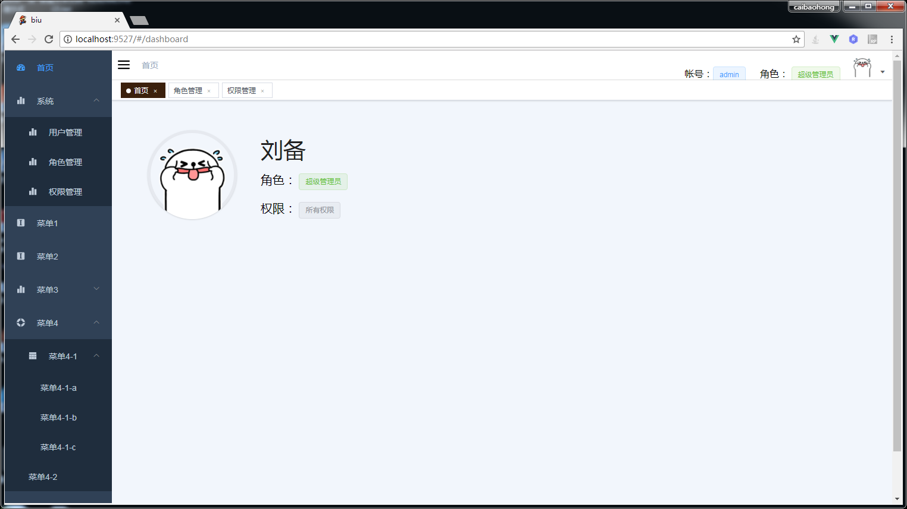
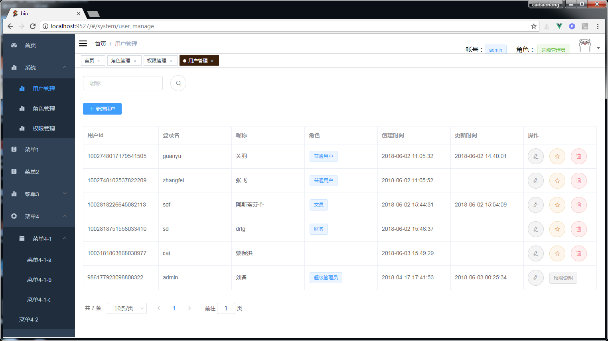
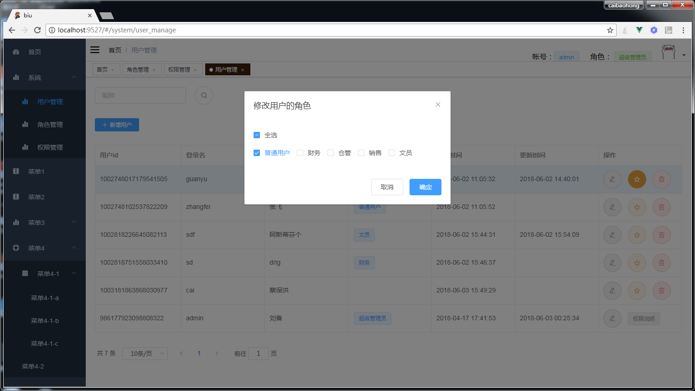
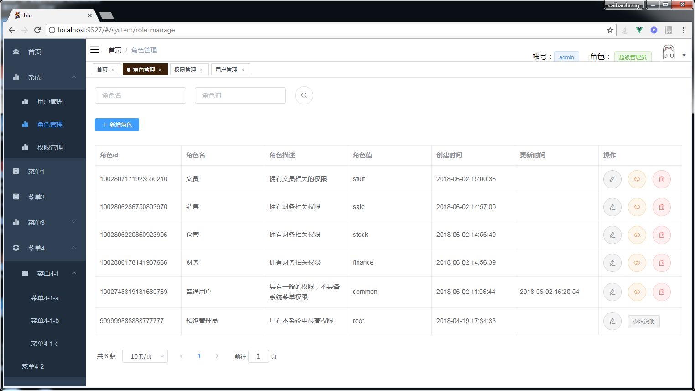
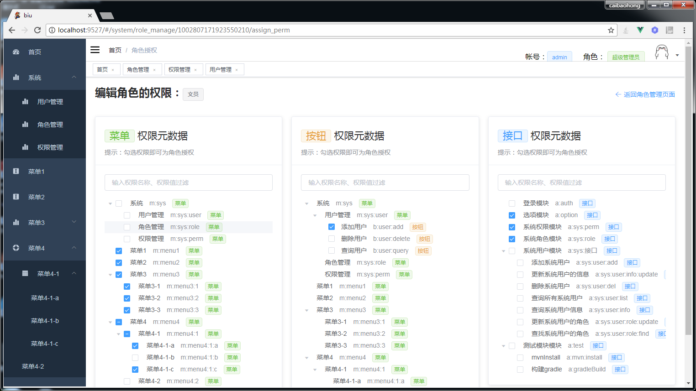
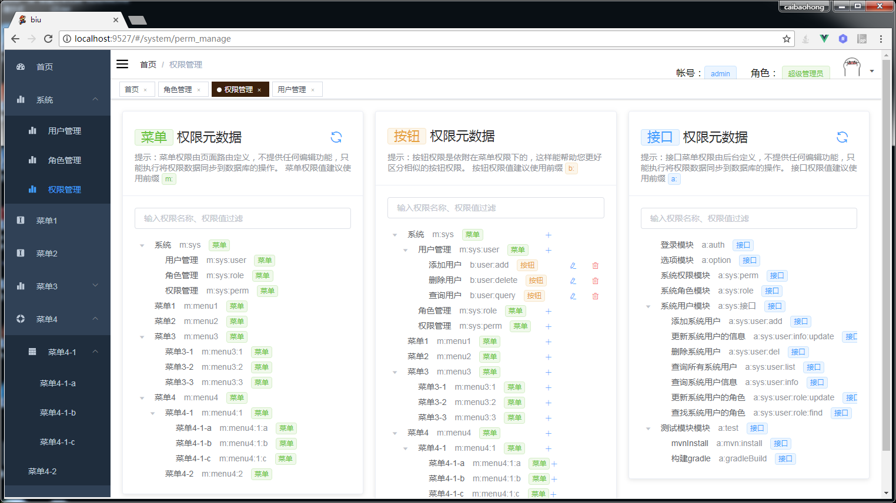

# biu

>Biu，boot和vue的连读而想到的名字。一个基于Spring Boot和Vue的Web开发脚手架，整合和最基础的RBAC权限控制，包括：菜单权限、按钮权限、接口权限。

- 前端使用vue-cli，后端使用Spring Boot，两个全家桶强强联合。
- 用简单优雅的方式整合shiro
- 使用Gradle持续构建特性，开发时修改java代码无需重启
- 使用vue-element-admin做前端模板，摆脱写jQuery的痛苦
- 多种灵活形式的前后端分离方式，包括开发阶段的前后端分离和部署的前后端分离

**效果图：**

## 如何开始开发

请先安装好依赖的开发环境：Java8、Gradle、Node.js、vue-cli。我自己使用的是Gradle4.6，Node8.11.1，vue-cli 2.9.3，建议使用Intellij IDEA。

克隆项目到本地：

~~~
git clone https://github.com/CaiBaoHong/biu
~~~

执行`_sql/biu.sql`导入mysql数据库

打开IDEA，`File - Settings - Build Execution Deployment - Build Tools - Gradle`配置好本机Gradle的路径。

打开IDEA，`File - Open`打开biu项目的路径，导入项目，弹出Gradle导入引导窗口的，按下一步就行，确定后项目开始初始化，
过程有点慢，其实就是下载server模块中Gradle声明的项目依赖。

下载好依赖后，我们还需要下载browser模块的依赖。在IDEA左下角打开一个Terminal命令行终端。`cd browser`然后`npm install`，等待依赖安装完成。

然后再新建两个Terminal命令行终端，即一共建三个命令行终端。

在第1个终端输入：
~~~
cd server
gradle build --continuous
~~~
启动gradle的持续构建

在第2个终端输入：
~~~
cd server
gradle bootRun
~~~
启动spring boot。有时候由于持续构建没有编译好，会导致spring boot启动失败。多试几次就行。

在第3个终端输入：
~~~
cd browser
npm run dev
~~~
启动spring boot。有时候由于持续构建没有编译好，会导致spring boot启动失败。多试几次就行。

待三个终端都启动完成，在浏览器页面访问前端页面：`http://localhost:9527`，页面上的ajax请求会转发到java后台的`8888`端口。

后端模块`server`由于使用了Gradle的持续构建，当我们编辑任何java代码时候，就会触发构建，spring boot会自动重新加载，无需我们自己手动重启。

前端模块`browser`是用`vue-element-admin`这个脚手架来做的，改动代码也无需重启。更多详情请看：[vue-element-admin](https://github.com/PanJiaChen/vue-element-admin)

## 如何部署

**打包server模块：**
~~~
cd server
gradle build
~~~
然后上传到服务器，启动：
~~~
java -jar server.jar
~~~

**打包browser模块：**
~~~
cd browser
npm run build:prod
~~~
然后上传到服务器，实用`nginx`对外提供网页内容，以及将网页的ajax请求转发到`server.jar`的后台。以下参考的配置：

~~~
 
user  nginx;
worker_processes  1;
 
error_log  /var/log/nginx/error.log warn;
pid        /var/run/nginx.pid;
 
 
events {
    worker_connections  1024;
}
 
 
http {
    include       /etc/nginx/mime.types;
    default_type  application/octet-stream;
 
    log_format  main  '$remote_addr - $remote_user [$time_local] "$request" '
                      '$status $body_bytes_sent "$http_referer" '
                      '"$http_user_agent" "$http_x_forwarded_for"';
 
    access_log  /var/log/nginx/access.log  main;
 
    sendfile        on;
    #tcp_nopush     on;
 
    keepalive_timeout  65;
 
    # compress static html files
    gzip on;
    gzip_min_length 1k;
    gzip_buffers 4 16k;
    gzip_comp_level 9;
    gzip_types text/plain application/x-javascript text/css application/xml text/javascript application/x-httpd-php image/jpeg image/gif image/png;    
    
    # virtual host for jujuju
    server{
        listen 80;
        index index.html;
        root /data/production/jujuju/html;
    }
 
    # virtural host for aaa/web 【就在这里！！】
    server{
        listen 9527;       
        index index.html;
        root /data/production/aaa/dist;                
        location /api/v1 {
            # proxy request to java server
            proxy_pass http://localhost:8888;
        }
    }
 
 
 
    include /etc/nginx/conf.d/*.conf;
}
~~~

## 其它信息

**1.如何整合shiro**

网上找到的文章，基本上都不是基于Spring Boot的starter来整合的，所以代码量比较多，而且比较繁杂。
其实shiro官方提供了starter，可以让我们优雅地把shiro整合到spring boot中。请看官网相关文档：
[Integrating Apache Shiro into Spring-Boot Applications](https://shiro.apache.org/spring-boot.html)

**2.权限管理的细节**

在“权限管理”菜单中。权限数据分为菜单、按钮、接口三种。

**菜单权限元数据**

菜单的权限元数据是定义在`browser/src/router/index.js`中的，
在这里定义的路由就可以显示成菜单。这些菜单路由可以添加`meta.perm`属性来声明访问该菜单所需要的权限值，而这个权限值，就是权限的元数据。
由于这个元数据是定义在前端的，后端的数据库中`sys_perm`表不一定有记录。
所以菜单权限元数据中会有一个他“同步”按钮，点击即可把页面上定义的权限值同步保存到后台数据库中。

**按钮权限元数据**

按钮权限是归属于菜单下的，这样有助于我们区分相似的按钮。比如，用户管理菜单下有“添加用户”，角色管理菜单下有“添加角色”，两个“添加”按钮，如果不各自挂载在对应菜单下，比较容易混淆。
按钮权限元数据是在数据库中直接定义的，所以对按钮权限元数据的增删查改，都是操作数据库中的数据。

**接口权限元数据**

接口的权限元数据是定义在`server/com/abc/controller`目录下的各种Controller中的，

在Controller的类上，会优先查找`@PermInfo`的value属性作为接口模块的权限名，查找`@RequiresPermissions`的值作为接口模块的权限值。
如果没有，则会把Controller类名作为接口模块权限的名称，把`@RequestMapping`作为接口模块权限的权限值。

对于在Controller的方法，只有注解了`@RequiresPermission`的方法，才会被视为接口权限元数据展示在“权限管理”菜单中。
获取接口权限元数据的逻辑是这样的：优先查找`@PermInfo`的value属性作为接口的权限名，查找`@RequiresPermissions`的值作为接口模块的权限值。
如果没有`@PermInfo`，则会把Controller方法名作为接口模块权限的名称

由于接口权限元数据的获取都会获取备选值，所以您不必担心没有使用`@PermInfo`来声明权限名称或权限值而导致无法显示接口权限元数据。

**3.为什么菜单权限和接口权限都不直接在数据库中维护元数据**

这样做是为了数据方便维护，当前端编辑完菜单路由数据或后端编辑完接口，还要“手工复制一份”到数据库，是很累很笨的事情。所以这里采用“同步”的方法把元数据写入`sys_perm`表。

**4.接口权限是啥？等同于按钮权限吗？**

接口权限是为了保护后台接口做的权限控制，它不等同与前台页面上的按钮权限，按钮权限是页面上根据用户登录后返回的权限值，判断用户是否有按钮上声明的权限值，如果没有就不显示该按钮。
但是接口还是可以通过http来调用的，所以需要接口权限的控制。而且，有的场景下，前台的一个按钮，不一定对应后台的一个接口调用，也有可能是多个接口的调用。所以我这里把“按钮”和“接口”的概念区分开了。

